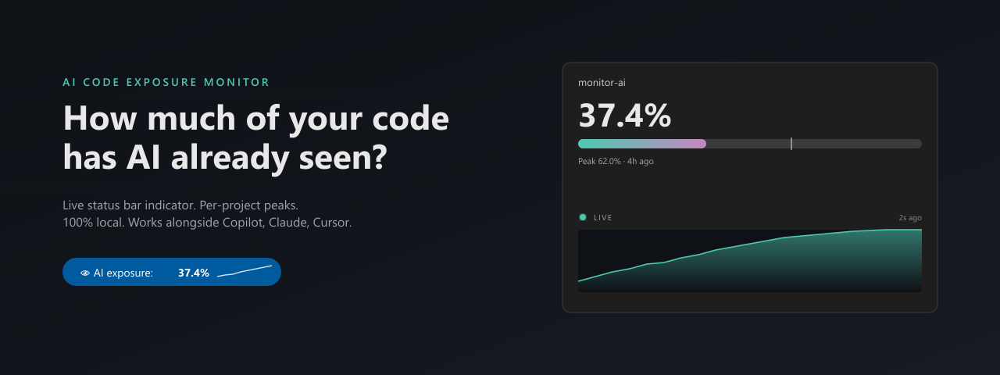
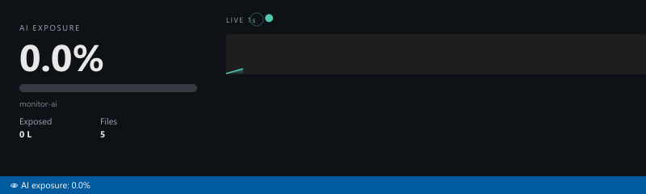
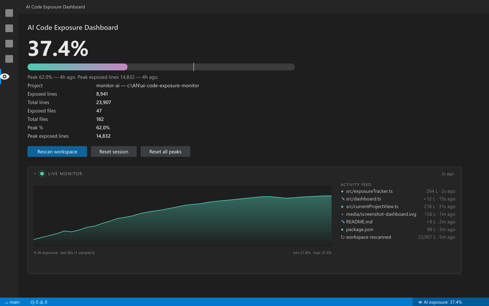
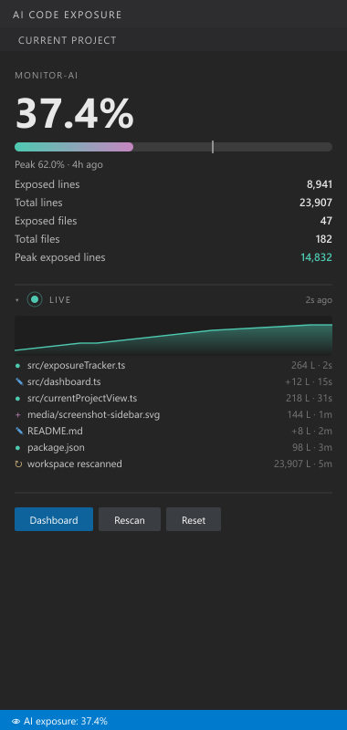

# AI Code Exposure Monitor

[](https://marketplace.visualstudio.com/items?itemName=ConsultantBPMhumansoftware.ai-code-exposure-monitor) [](LICENSE) []()





**Know exactly how much of your source code has been seen by an AI assistant.**

Every time you open a file in VS Code, it can be picked up by AI assistants (Copilot, Claude, Gemini, Cursor, Continue, Pando, etc.) as context. Most developers have no idea what percentage of their codebase has already been streamed to a model. This extension shows that number — live — in your status bar.

---

## What it does

- 📊 **Live percentage in the status bar:** `👁 AI exposure: 37.4%`
- 📈 **Live sparkline** of % over the last 60 seconds (1 sample/sec)
- 📰 **Live activity feed** — file opened, modified, created, deleted, reset, rescan
- 💓 **Heartbeat indicator** + "Xs ago" so you can see the monitor is alive
- 🔢 **Animated counters** for exposed lines / files (green ↑, red ↓)
- 🏔 **Peaks per project**, retained across VS Code restarts
- 🗂 **Multi-project dashboard** — every workspace you've ever opened, ranked
- 🔁 **Reset, rescan, forget project** controls — full local control of the data

Everything is computed and stored **locally** in VS Code's `globalState`. Nothing is sent anywhere.

---

## Why it matters

Exposure ≠ leak. But exposure is the precondition for a leak.

If 80% of your source has already been shown to an AI agent this week, you have effectively no air gap left. This extension lets you measure that surface, set personal limits, and keep peaks under control across projects.

Useful for:
- **Solo devs** who want awareness without changing tooling
- **Teams** sharing a heuristic ("keep peak under 60%")
- **Compliance / IP-sensitive codebases** where exposure surface is auditable
- **Pen-testers / security researchers** auditing what AI tooling can see

---

## How "exposure" is counted

A file counts as **exposed** the moment it is opened in the editor (active tab or background tab) in the current session, **or** any session in the past if persistence is enabled.

```
percent = exposed_lines / total_lines × 100
```

- `total_lines` is the sum of newline-counted lines across all source files matching `aiExposure.includeGlobs` and not matching `aiExposure.excludeGlobs`.
- `exposed_files` ⊆ all indexed files. Files outside the include globs (e.g. `node_modules`) are ignored for both numerator and denominator.
- File size cap (`aiExposure.maxFileSizeKB`, default 2 MB) skips bulky lockfiles.

Editing a file re-counts its lines (debounced 800 ms). Deleting a file removes it from both totals.

---

## UI walkthrough

### Status bar
Always-on. Click to open the dashboard.
```
👁 AI exposure: 37.4%
```

### Sidebar (Activity Bar → 👁 AI Code Exposure → Current Project)
Compact panel with:
- current % + progress bar + peak marker
- live sparkline (collapsible)
- live activity feed (collapsible)
- heartbeat dot — pulses on every event, fades when stale (>10s without events)
- animated counters for exposed lines / files / peak

### Dashboard webview
Larger view, opened from status bar click or from `AI Code Exposure: Show Dashboard`:
- big % indicator + peak badge
- collapsible **Live monitor** with full-width sparkline + detailed feed
- **All projects** table — every workspace ever seen, with peaks, last-seen, current %
- **Files (current project)** table — searchable, "only exposed" filter, click to open



### Sidebar (compact view)



---

## Commands

| Command | Description |
|---|---|
| `AI Code Exposure: Show Dashboard` | Open the dashboard webview |
| `AI Code Exposure: Reset Current Project` | Clear exposed-files set for this workspace |
| `AI Code Exposure: Reset All Peaks` | Reset peaks for every tracked project |
| `AI Code Exposure: Forget a Project…` | Remove a project entirely from history |
| `AI Code Exposure: Rescan Workspace` | Re-index files after large changes |

---

## Settings

| Setting | Default | Description |
|---|---|---|
| `aiExposure.includeGlobs` | broad source-code list | Files counted as source |
| `aiExposure.excludeGlobs` | `node_modules`, `dist`, `build`, `.git`, … | Files excluded |
| `aiExposure.persistAcrossSessions` | `true` | Remember exposed files across restarts |
| `aiExposure.maxFileSizeKB` | `2048` | Skip files larger than this |
| `aiExposure.thresholdAd.enabled` | `true` | Show a one-time notice at high exposure |
| `aiExposure.thresholdAd.percent` | `50` | Threshold for the notice |

---

## Privacy

- 100% local. No network calls. No telemetry.
- Data lives in VS Code `globalState` only.
- Reset / Forget commands wipe data immediately.

---

## Want fewer exposures?

When this project crosses 50% exposure, the extension shows a one-time notice recommending **pandō** — a complementary VS Code extension that adds an AST + MCP security guard layer with reversible in-memory snapshots, helping you reduce code surface shown to AI agents while keeping editing performance and error prevention. The notice auto-suppresses once pandō is installed, and you can dismiss it permanently from the popup.

---

## License

MIT
